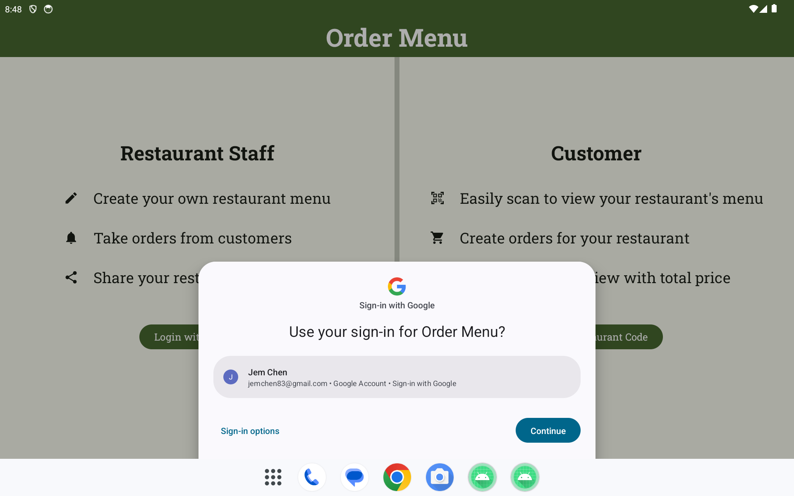
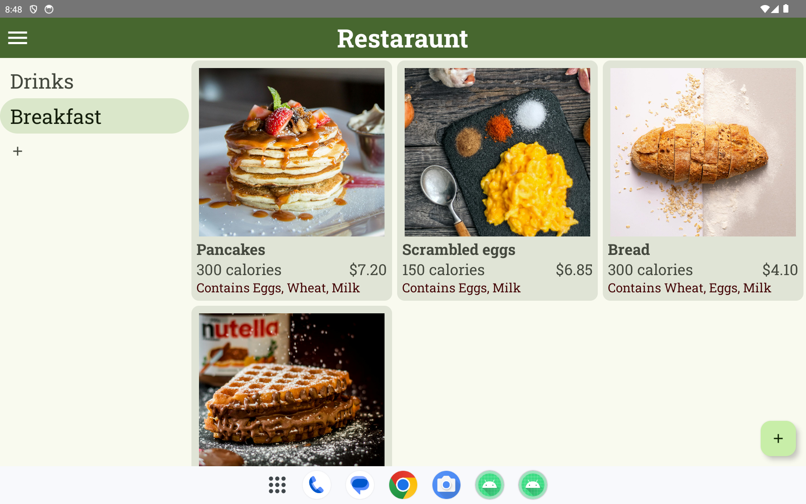
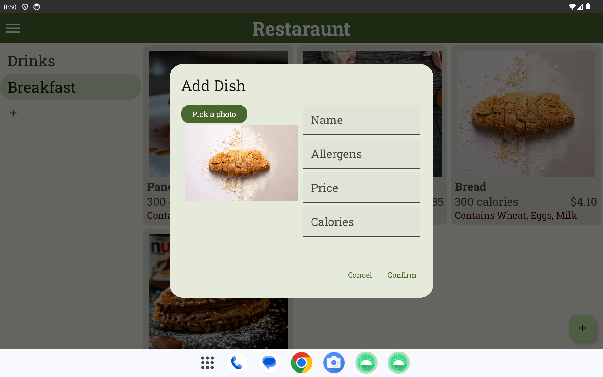
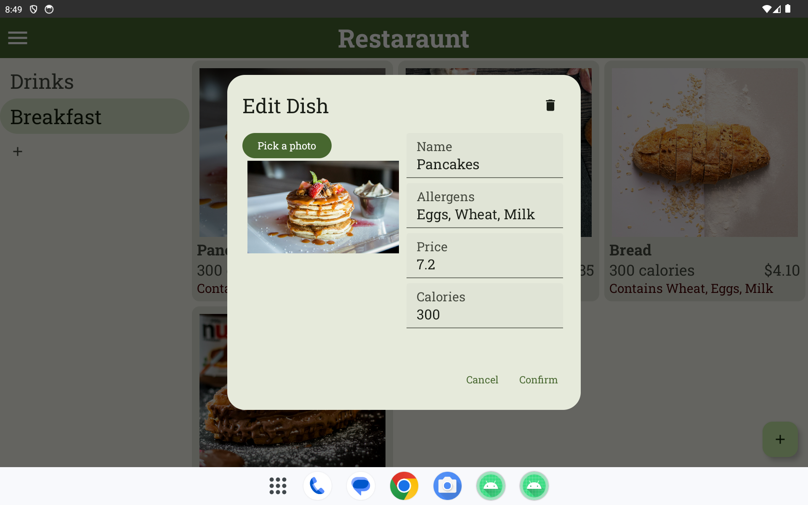
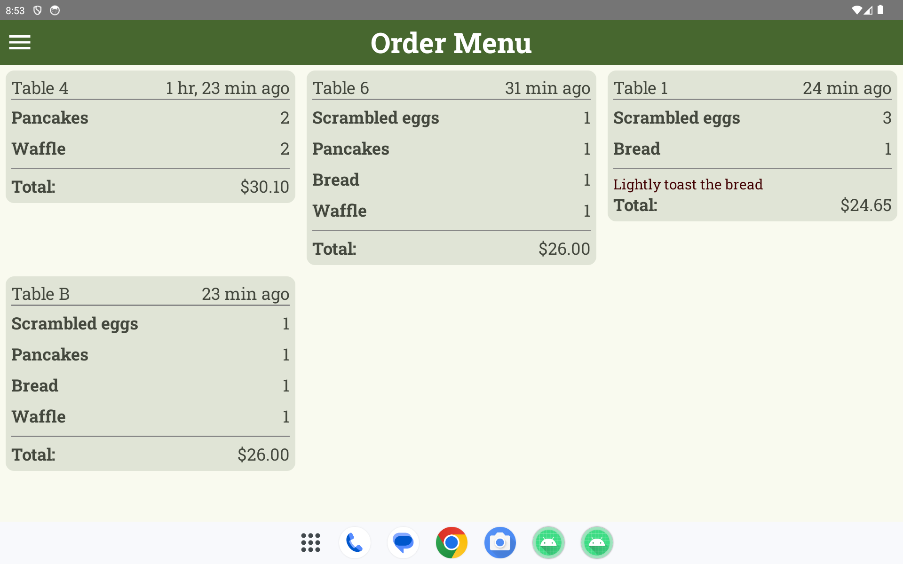
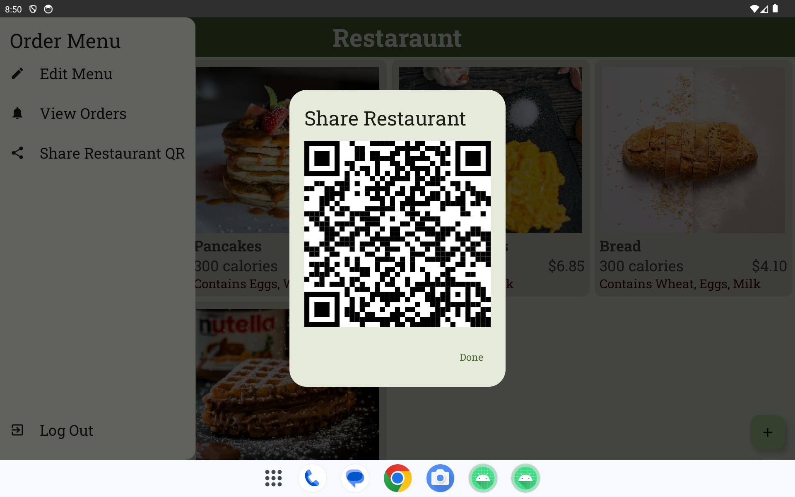
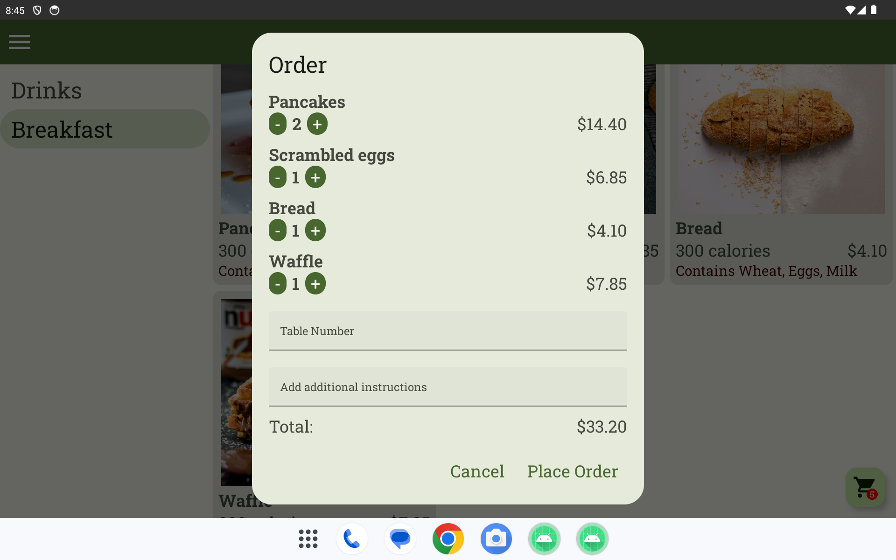

# Order Menu

## Overview
Order Menu is an android app, allowing any restaurant to create their own online menu for taking customer orders.
The app is designed for use by restaurants that provide a device for customers to order with.

## Features

### Restaurant Staff
- Log in with Google Oauth, maintaining session after closing the app
- Create a custom restaurant menu with multiple categories and dishes
- View and complete customer orders coming in live on a grid
- Display a restaurant QR code for customer order devices to scan

### Customer
- Scan a restaurant's QR code to open the menu
- View a restaurant's menu with items displayed in a grid, separated by category
- Build and edit a cart of dishes to order, keeping track of the total price
- Add custom instructions before sending the order

## Screenshots

### Restaurant Staff

### Customer

## Technologies used
- Languages: Kotlin
- UI: Jetpack Compose
- Authentication: Firebase Authentication with Google Credential Manager
- Database: Firebase Cloud Firestore
- Dependency Injection: Dagger Hilt
- Async: Flow, Coroutines
- Local storage: Preferences Datastore
- QR Code: ZXing, Compose QR Code
- Architecture: MVVM

## Contact
- **Email:** jemchen83@gmail.com
- **LinkedIn:** Jem Chen(https://www.linkedin.com/in/jem-chen/)

## License
This project is licensed under the MIT License.